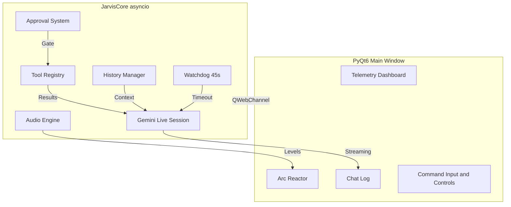

# J.A.R.V.I.S. — Just A Rather Very Intelligent System

[](https://www.python.org/downloads/)
[](https://opensource.org/licenses/MIT)
[](https://ai.google.dev/)

> *"I have indeed been uploaded, sir. We're online and ready."*

A local, system-level AI assistant built on **PyQt6** and **Google's Gemini Live API**. Styled after Tony Stark's HUD with a real-time arc reactor, telemetry dashboard, and full PC control — all in a single self-contained Python file.


---

## Why J.A.R.V.I.S.?

Most AI assistants are chatbots in a browser. **J.A.R.V.I.S. is different:**

- **System-level control** — Not just answers, but *actions*. Edit files, run shell commands, manage processes, control windows.
- **Sci-fi HUD interface** — Built like Tony Stark's helmet display, not a chat window. Real-time telemetry, animated arc reactor, toast notifications.
- **Single-file deployment** — One `jarvis.py`. No Docker, no microservices, no complexity.
- **Privacy-first** — Runs locally. Your API key, your machine, your data.
- **Voice-native** — Speak to it, it speaks back. Full duplex audio streaming.

---

## Table of Contents

- [Demo](#demo)
- [Features](#features)
- [Screenshots](#screenshots)
- [Quick Start](#quick-start)
- [Installation](#installation)
- [Configuration](#configuration)
- [Available Tools](#available-tools)
- [Safety & Security](#safety--security)
- [Architecture](#architecture)
- [Keyboard Shortcuts](#keyboard-shortcuts)
- [Troubleshooting](#troubleshooting)
- [Contributing](#contributing)
- [License](#license)

---

## Demo

> 

---

## Features

### Core AI
- **Multimodal Live Streaming** — Real-time text, voice, and vision via Gemini Live API
- **Bidirectional Audio** — Speak to JARVIS, JARVIS speaks back (24kHz output, 16kHz input)
- **Vision Analysis** — Screenshot capture + image upload from disk (PNG/JPG/WEBP/GIF)
- **Streaming Responses** — Token-by-token display with live typing indicator
- **Smart Context Management** — 50-turn rolling history with automatic compression digests
- **Session Resumption** — Survives disconnections with token-based context restoration

### System Control (25+ Tools)
- **Full Filesystem Access** — Browse, read, write, search, diff-edit, delete
- **Process Management** — List, monitor, and interact with running applications
- **Input Automation** — Type text, press keys, read/write clipboard
- **Shell Execution** — Run commands with 30s timeout and output capture
- **Cross-Platform Window Control** — Focus windows on Windows, Linux (xdotool/wmctrl), and macOS (AppleScript)
- **Web Search & Fetch** — DuckDuckGo search, URL content extraction with safety validation
- **Weather & Utilities** — Current conditions via Open-Meteo, timers, notes, calculator, dictionary, translation

### Safety & Security
- **Dangerous Tool Approval** — Modal confirmation for `execute_shell`, `write_file`, `move_file`, `delete_file`, `apply_diff`
- **Auto-Backup on Edit** — `.jarvis_backups/` snapshots before any diff operation
- **URL Safety Filter** — Blocks localhost, private IPs, loopback, and non-HTTP schemes
- **Math Sandbox** — AST-whitelisted expression evaluation, no arbitrary code execution
- **60-Second Approval Timeout** — Auto-deny if user doesn't respond

### Audio System
- **Device Selection** — Dropdown pickers for input and output audio devices
- **Volume Control** — 0x–2x gain with numpy-based scaling
- **Real-Time Visualizer** — 32-bar animated audio level meter on the arc reactor
- **Voice Activity Detection** — Live input level monitoring

### Desktop Integration
- **System Tray** — Background operation with Show/Hide/Quit menu
- **Global Hotkey** — `Ctrl+Alt+J` summons JARVIS from anywhere (requires `pynput`)
- **Startup Minimized** — Launch to tray, summon when needed
- **Persistent Configuration** — Auto-saved settings in `jarvis_config.json`

### Visual Interface
- **Arc Reactor HUD** — 5-layer animated SVG with state-reactive color coding
- **Real-Time Telemetry** — CPU, RAM, disk, network I/O, active window (1s refresh)
- **Sci-Fi Aesthetics** — Orbitron display font, cyan glow effects, corner brackets, grid overlays
- **Markdown + Code** — Syntax highlighting, copy buttons, streaming text rendering
- **Toast Notifications** — Non-intrusive status alerts with type-based coloring

---

## Screenshots

| Full HUD | Telemetry | Arc Reactor | Chat Log | Controls |
|----------|-----------|-------------|----------|----------|
|  |  |  |   |  |

---

## Quick Start

### 1. Get a Gemini API Key

[→ Google AI Studio](https://aistudio.google.com/app/apikey)

### 2. Create `api_keys.json`

```json
{
  "gemini_api_key": "YOUR_KEY_HERE"
}
```

### 3. Install Dependencies

```bash
pip install -r requirements.txt
```

### 4. Run

```bash
python jarvis.py
```

### 5. First-Time Setup

On first launch, `jarvis_config.json` is auto-created with sensible defaults. The approval system is **enabled by default** — dangerous tools will prompt you before executing.

---

## Installation

### Requirements

| Requirement | Version | Notes |
|-------------|---------|-------|
| Python | 3.10+ | 3.14+ may need `--only-binary` for some deps |
| PyQt6 | 6.5+ | Includes QtWebEngine |
| google-genai | Latest | Gemini Live API SDK |
| psutil | Latest | System telemetry |
| pyautogui | Latest | Input automation |
| pyperclip | Latest | Clipboard access |
| sounddevice | Latest | Audio I/O |

### Windows

```powershell
pip install -r requirements.txt
```

### Linux

```bash
# Debian/Ubuntu — Qt6 and audio dependencies
sudo apt-get install libqt6webenginecore6 libqt6webenginewidgets6 libportaudio2

# Window control (for focus_window)
sudo apt-get install xdotool wmctrl

pip install -r requirements.txt
```

### macOS

```bash
# Audio backend
brew install portaudio

pip install -r requirements.txt
```

---

## Configuration

`jarvis_config.json` (auto-created on first run):

```json
{
  "gemini_api_key": "",
  "model": "gemini-2.5-flash-native-audio-latest",
  "voice_enabled": false,
  "mic_enabled": false,
  "audio_output_device": null,
  "audio_input_device": null,
  "confirm_dangerous": true,
  "startup_minimized": false,
  "global_hotkey": "ctrl+alt+j",
  "max_history": 50,
  "volume": 1.0
}
```

| Key | Description |
|-----|-------------|
| `model` | Default Gemini model |
| `voice_enabled` | Enable TTS output |
| `mic_enabled` | Enable voice input |
| `audio_output_device` | Sound device index (null = default) |
| `audio_input_device` | Mic device index (null = default) |
| `confirm_dangerous` | Show approval modal for destructive tools |
| `startup_minimized` | Launch to system tray |
| `global_hotkey` | Key combo to summon window |
| `max_history` | Conversation turns before compression |
| `volume` | Output gain multiplier (0.0–2.0) |

---

## Available Tools

### File System

| Tool | Description | Approval |
|------|-------------|----------|
| `list_directory` | Browse folders with size/date info | No |
| `read_file` | Read text files (50KB cap) | No |
| `write_file` | Create/overwrite files, auto-mkdir | **Yes** |
| `append_file` | Append text without overwriting | No |
| `move_file` | Rename/move files and folders | **Yes** |
| `delete_file` | Delete files/empty directories | **Yes** |
| `create_directory` | Create folder trees | No |
| `search_files` | Glob-based filename search | No |
| `search_file_contents` | Regex grep across files | No |
| `explore_pc` | Recursive directory reconnaissance | No |
| `smart_search` | Combined filename + content search | No |
| `apply_diff` | Surgical text replacement with auto-backup | **Yes** |

### System Control

| Tool | Description | Platform |
|------|-------------|----------|
| `open_application` | Launch apps, open files/URLs | All |
| `execute_shell` | Run shell commands (30s timeout) | All |
| `take_screenshot` | Capture and transmit screen | All |
| `read_image` | Upload local images for AI vision | All |
| `get_system_info` | OS, CPU, RAM, battery diagnostics | All |
| `list_processes` | Running processes with CPU/RAM % | All |
| `get_active_window` | Current window title | Windows |
| `focus_window` | Switch to window by title | Win/Linux/macOS |

### Input Automation

| Tool | Description |
|------|-------------|
| `type_text` | Simulate keystrokes into active window |
| `press_key` | Single keys or combos (`ctrl+c`, `alt+tab`) |
| `read_clipboard` | Read system clipboard |
| `write_clipboard` | Write to system clipboard |

### Internet & Utilities

| Tool | Description | API Key |
|------|-------------|---------|
| `web_search` | DuckDuckGo HTML search | None |
| `fetch_url` | Read/summarize webpages (8K cap) | None |
| `get_weather` | Current weather + IP geolocation | None |
| `set_timer` | Countdown with beep + toast | None |
| `take_note` | Append to `~/Documents/JARVIS_Notes.md` | None |
| `calculate` | Safe math evaluation (AST sandbox) | None |
| `get_definition` | Dictionary lookup | None |
| `translate` | Translation via MyMemory | None |

---

## Safety & Security

### Approval System

Destructive tools trigger a sci-fi styled modal in the HUD:

```
┌─────────────────────────────────────────┐
│  EXECUTION REQUEST                      │
│                                         │
│  Protocol: execute_shell                │
│  {                                      │
│    "command": "rm -rf ~/important"      │
│  }                                      │
│                                         │
│  [ DENY ]        [ AUTHORIZE ]          │
└─────────────────────────────────────────┘
```

- **Auto-deny** after 60 seconds of inactivity
- **Configurable** — set `"confirm_dangerous": false` to bypass
- **Logged** — all approvals/denials recorded in `jarvis.log`

### URL Safety

All fetched URLs pass through `_is_safe_url()`:

- Blocks `localhost`, `127.0.0.1`, `::1`, private ranges (`10.x`, `192.168.x`, etc.)
- Resolves hostnames and validates all returned IP addresses
- Whitelist: `http://` and `https://` only

### Math Sandbox

The calculator uses AST parsing with a strict whitelist:

- Allowed: `+`, `-`, `*`, `/`, `//`, `%`, `**`, `^`, `sqrt`, `sin`, `cos`, `tan`, `log`, `pi`, `e`, etc.
- Blocked: `__builtins__`, arbitrary identifiers, attribute access, imports

---

## Architecture



### Key Components

| Module | Responsibility |
|--------|--------------|
| `JarvisMainWindow` | PyQt6 shell, system tray, global hotkey, telemetry bridge |
| `JarvisCore` | Asyncio event loop, Gemini session management, tool dispatch |
| `PyBridge` | QWebChannel QObject — Python to JavaScript signal/slot bridge |
| `AudioPlayer` | `sounddevice` RawOutputStream with volume scaling |
| `AudioRecorder` | `sounddevice` RawInputStream with 100ms batching |
| `TelemetryWorker` | `psutil` polling thread (1s interval) |
| `ResponseWatchdog` | `threading.Timer` — aborts stuck model responses |

---

## Keyboard Shortcuts

| Shortcut | Action |
|----------|--------|
| `Enter` (in input) | Send command |
| `↑` / `↓` (in input) | Navigate command history |
| `Ctrl+Alt+J` | Show/hide window (global, requires `pynput`) |

---

## Troubleshooting

### "No module named 'PyQt6'"
```bash
pip install pyqt6 pyqt6-webengine
```

### Audio device not found
```bash
# List devices
python -c "import sounddevice as sd; print(sd.query_devices())"
```

### Global hotkey not working
Install `pynput` or run without it — all other features work fine:
```bash
pip install pynput
```

### "numpy build failed" on Python 3.14
```bash
pip install numpy --only-binary :all:
```

### Connection timeouts
The watchdog (45s) will auto-relink. Check `jarvis.log` for detailed error traces.

---

## Contributing

1. Fork the repo
2. Create a feature branch (`git checkout -b feature/amazing-thing`)
3. Verify syntax: `python -m py_compile jarvis.py`
4. Submit a Pull Request

Please keep it single-file unless there's a compelling reason to split. That's the core philosophy.

---

## License

MIT License — see [LICENSE](LICENSE) for details.

> *This project is not affiliated with Marvel, Disney, or Tony Stark. J.A.R.V.I.S. is a fan implementation for educational and personal automation purposes.*

---

## Acknowledgments

- [Google Gemini](https://ai.google.dev/) for the Live API
- [PyQt6](https://www.riverbankcomputing.com/software/pyqt/) for the Qt bindings
- [psutil](https://github.com/giampaolo/psutil) for system metrics
- [sounddevice](https://python-sounddevice.readthedocs.io/) for audio I/O
- [highlight.js](https://highlightjs.org/) & [marked](https://marked.js.org/) for chat rendering
